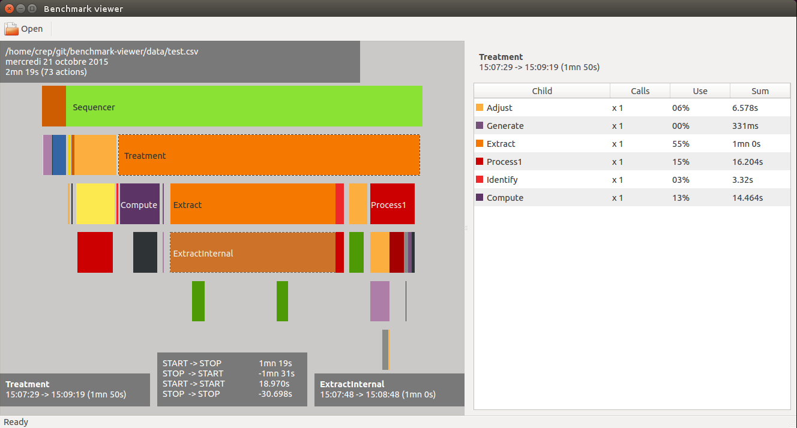
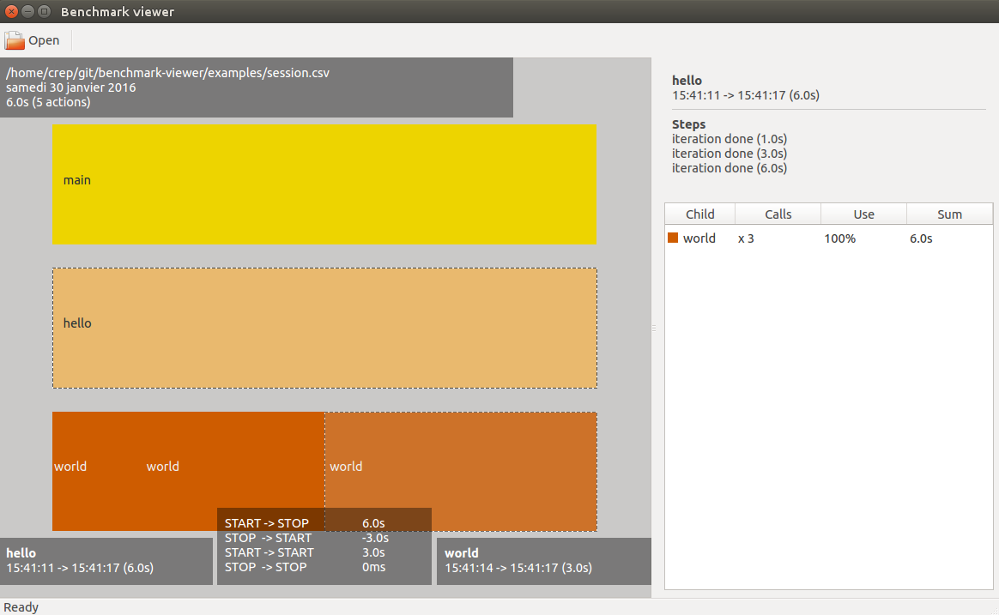

# Description
Visualize benchmark results as a timeline

# Screenshot

# Benchmark-viewer
* required packages: cmake, libqt4-dev

* build and run:

>     git clone git://github.com/crep4ever/benchmark-viewer.git
>     cd benchmark-viewer
>     mkdir build && cd build
>     cmake -DCMAKE_BUILD_TYPE=Release .. && make
>     sudo make install
>     cd -
>     benchmark-viewer data/example.csv

# Generate benchmark logs
The directory `examples` contains a minimal program example
that generates benchmark logs.

>     cd examples
>     g++ benchmark.cc main.cc
>     ./a.out # generates benchmark logs in session.csv
>     benchmark-viewer session.csv

# Contact
* romain.goffe@gmail.com
